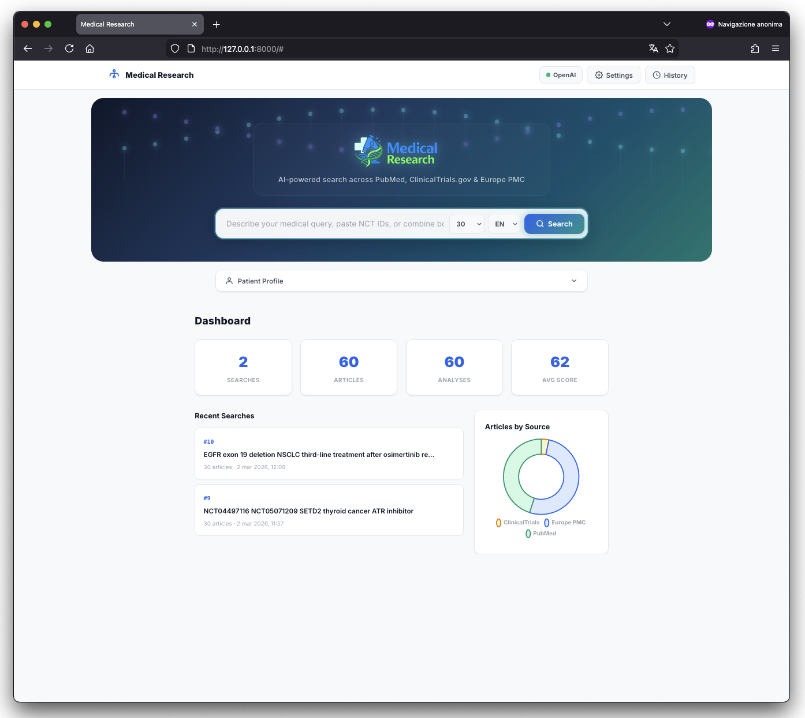
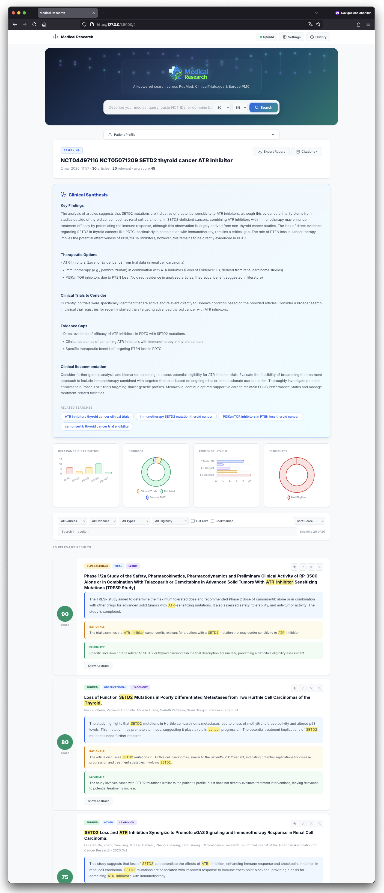

<p align="center">
  
</p>

<h1 align="center">Medical Research</h1>

<p align="center">
  <strong>AI-powered medical literature search across PubMed, ClinicalTrials.gov & Europe PMC</strong>
</p>

<p align="center">
  
  
  
  
</p>

---

## What is Medical Research?

**Medical Research** is a web application designed for clinicians, oncologists, and medical researchers who need to quickly find, analyze, and synthesize scientific literature relevant to their patients.

Instead of manually searching multiple databases, copying results, and reading dozens of abstracts, Medical Research does it all in one click — powered by AI.

<p align="center">
  
</p>

### Key Benefits

- **Save hours of manual searching** — simultaneously queries PubMed, ClinicalTrials.gov, and Europe PMC
- **AI-powered analysis** — every article is scored for relevance, evidence level, and article type
- **Patient-specific results** — attach a patient profile and get eligibility assessments for clinical trials
- **Clinical synthesis** — generates a structured evidence summary with therapeutic options and recommendations
- **Multi-language** — output in English, Italian, Spanish, French, or German
- **Privacy-first** — runs locally on your machine, your data stays with you

---

## Features

<p align="center">
  
</p>

### Intelligent Search
- **Smart query planning** — AI generates optimized search queries with MeSH terms for each database
- **NCT ID detection** — paste clinical trial IDs directly (e.g., `NCT04497116`) for instant lookup
- **Deduplication** — automatically removes duplicate articles across databases
- **Configurable results** — choose 10, 20, 30, 50, 100, or all results

### AI Analysis
- **Relevance scoring** (0-100) for each article against your query
- **Evidence level classification** (L1 Meta-analysis → L5 Expert opinion)
- **Article type detection** (trial, review, meta-analysis, guideline, etc.)
- **AI summaries** of key findings in your chosen language
- **Full-text analysis** when available (via Europe PMC open access)

### Patient Profiles
- Create patient profiles with diagnosis, mutations, treatments, and comorbidities
- Get **eligibility assessments** for clinical trials based on patient data
- Profiles are saved and reusable across searches

### Clinical Synthesis
- Automated **evidence-based synthesis report** including:
  - Key findings across all articles
  - Therapeutic options with evidence levels
  - Active clinical trials to consider
  - Evidence gaps
  - Clinical recommendations
- **Suggested follow-up queries** to deepen the research

### Tools & Export
- **Interactive charts** — relevance distribution, sources, evidence levels, eligibility
- **Advanced filters** — by source, evidence level, article type, eligibility, full-text, bookmarks
- **Article notes & bookmarks** — mark articles as important, reviewed, or dismissed
- **Export** — HTML report, RIS (Zotero/Mendeley), BibTeX (LaTeX)
- **Search history** with dashboard statistics

### Multi-Provider AI

Choose the AI provider that best fits your needs:

| Provider | Best For | Cost |
|----------|----------|------|
| **Claude** (Anthropic) | Best accuracy and reasoning | Pay per use |
| **OpenAI** (GPT-4o) | Fast, widely available | Pay per use |
| **Ollama** (Local) | Privacy, no cost, medical models | Free (runs locally) |

Switch providers anytime from the Settings panel — no restart needed.

---

## Installation

### Prerequisites

- **Python 3.11+** — [Download Python](https://www.python.org/downloads/)
- **An AI provider** (at least one):
  - Claude API key, OR
  - OpenAI API key, OR
  - Ollama installed locally

### Step 1: Download the project

```bash
git clone https://github.com/Pinperepette/Medical-Research.git
cd Medical-Research
```

Or download and extract the ZIP file.

### Step 2: Create a virtual environment

**macOS / Linux:**
```bash
python3 -m venv venv
source venv/bin/activate
```

**Windows:**
```bash
python -m venv venv
venv\Scripts\activate
```

### Step 3: Install dependencies

```bash
pip install -r requirements.txt
```

### Step 4: Launch the app

```bash
uvicorn app.main:app --host 0.0.0.0 --port 8000
```

### Step 5: Open in your browser

Go to **http://localhost:8000**

### Step 6: Configure your AI provider

1. Click the **Settings** button in the top bar
2. Choose your provider (Claude, OpenAI, or Ollama)
3. Enter your API key or configure your local model
4. Click **Test Connection** to verify
5. Click **Save**

That's it! You're ready to search.

---

## Getting API Keys

### Option A: Claude (Anthropic) — Recommended

1. Go to [console.anthropic.com](https://console.anthropic.com/)
2. Sign up or log in
3. Go to **API Keys** → **Create Key**
4. Copy the key (starts with `sk-ant-...`)
5. Paste it in **Settings → Claude → API Key**

### Option B: OpenAI

1. Go to [platform.openai.com](https://platform.openai.com/)
2. Sign up or log in
3. Go to **API Keys** → **Create new secret key**
4. Copy the key (starts with `sk-...`)
5. Paste it in **Settings → OpenAI → API Key**

### Option C: Ollama (Free, Local, Private)

Ollama lets you run AI models locally on your own machine — completely free and private. No data leaves your computer.

#### Install Ollama

1. Go to [ollama.com](https://ollama.com/) and download for your OS
2. Install and run it (it runs in the background)

#### Install a model

Open a terminal and run:

```bash
# General purpose (fast, good quality)
ollama pull llama3

# Medical-specialized models (recommended for clinical use)
ollama pull medllama2
ollama pull OussamaELALLAM/MedExpert
```

> **Note:** Medical models may provide more accurate clinical assessments but are typically slower. General models like `llama3` work well for most queries.

#### Configure in the app

1. Open **Settings** in the app
2. Select **Ollama**
3. Base URL: `http://localhost:11434` (default)
4. Click the **refresh button** to see installed models
5. Select your model and **Save**

> **Important:** Ollama processes one request at a time. Analysis of many articles will take longer compared to cloud providers. This is normal.

---

## Usage Tips

1. **Be specific with queries** — "EGFR exon 19 deletion NSCLC third-line after osimertinib" works better than "lung cancer treatment"
2. **Use patient profiles** — adding patient details dramatically improves relevance scoring and enables eligibility assessment
3. **Paste NCT IDs** — you can mix NCT IDs with free-text queries: `NCT04497116 NCT05071209 SETD2 thyroid cancer`
4. **Try suggested queries** — after each search, the AI suggests follow-up queries to explore
5. **Export for your team** — use the HTML report or citation export to share findings

---

## Tech Stack

- **Backend:** Python, FastAPI, SQLite
- **Frontend:** Vanilla HTML/CSS/JS, Chart.js
- **AI:** Anthropic Claude, OpenAI GPT, Ollama (local)
- **Data Sources:** PubMed (NCBI), ClinicalTrials.gov, Europe PMC

---

## License

MIT License — free for personal and commercial use.

---

<p align="center">
  <em>Built for clinicians, by developers who care about medical research.</em>
</p>
